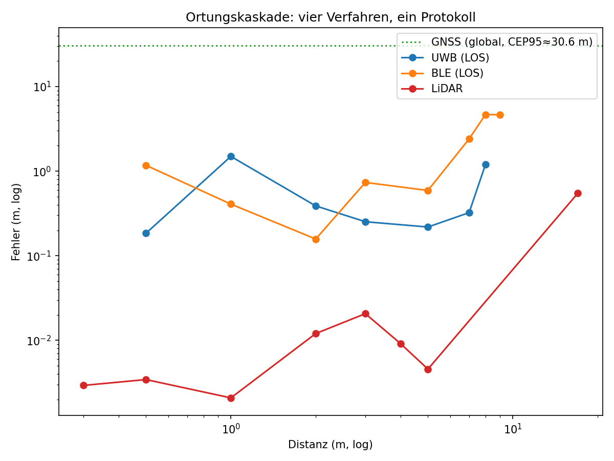

# Kaskade

Native iOS-App, die Reisen aufzeichnet, den Transportmodus klassifiziert
und vier Ortungsverfahren gegen jeweils eine eigene Referenz vermisst: GNSS gegen ALKIS-Referenzpunkte, Ultrabreitband
gegen Bluetooth-RSSI, LiDAR gegen ein Maßband, das eigene
Klassifikationsmodell gegen `CMMotionActivity`. Ein Python-Teil trainiert das
Modell auf dem GeoLife-Datensatz und erzeugt aus den eingecheckten Rohdaten
alle Abbildungen und Tabellen des Abgabedokuments.

Der Name ist das Ergebnis: Ortung ist keine einzelne Technologie mit einer
Genauigkeitsangabe, sondern eine maßstabsabhängige Kaskade — GNSS global,
UWB und BLE im Nahbereich, LiDAR unter fünf Metern. Alle vier liegen in
einer Abbildung auf derselben Achse, Distanz gegen Positionsfehler, log-log.



## Was gemessen wurde

GNSS an drei Referenzpunkten (n=868/26/42 Fixes): CEP95 zwischen 5,1 m am
abgeschatteten Punkt und 32,3 m in der Straßenschlucht. Der
Straßenschlucht-Punkt ist bimodal — CEP50 bei 0,38 m, CEP95 fast hundertmal
so groß. Die Mehrheit der Fixes sitzt also nah am wahren Punkt, eine
Minderheit reißt über Gebäudefassaden aus.

UWB bleibt zwischen 0,5 m und 7 m Solldistanz bei 0,18–0,39 m mittlerem
Absolutfehler, mit oder ohne Sichtkontakt. BLE-RSSI wächst über 5 m hinaus
auf 4,7 m Fehler bei 8 m. Bei 9 m brach das UWB-Ranging reproduzierbar ab,
schon bei 8 m steigt der Fehler auf 1,1 m — eine praktische
Reichweitengrenze unterhalb der Spezifikation.

LiDAR liegt im spezifizierten Bereich 0,3–5 m bei 1,2–29 mm Fehler, tags wie
nachts. Eine Testmessung bei 17 m, weit außerhalb der rund 5 m
Scanner-Spezifikation, springt auf 0,55 m.

Für M2 (Transportmodus im Feld) liegen sechs Segmente aus vier Aufzeichnungen
vor: eine Radfahrt, zwei Zugfahrten, eine Busfahrt und zwei Fußwege. Beide
Verfahren treffen vier von sechs, im Macro-F1 über die vier gefahrenen
Klassen liegt das eigene Modell mit 0,54 leicht unter `CMMotionActivity`
mit 0,62. Sie scheitern an verschiedenen Stellen: `CMMotionActivity` kann
`train` nicht vergeben (die Klasse fehlt in seinen fünf Zuständen, es meldete
auf den Zugfahrten 62 und 83 Prozent `automotive`) und trifft die Radfahrt;
das eigene Modell erkennt eine der beiden Zugfahrten und hält die Radfahrt
für `car`. Bei höchstens zwei Segmenten je Klasse ist das kein Güteergebnis,
der Mehrmodi-Feldtest steht aus.

Details, Tabellen und die Auswertungsskripte dahinter:
[docs/abgabe/abgabe.pdf](docs/abgabe/abgabe.pdf).

## Struktur

- `ios/` — SwiftUI-App (iOS 17+, echtes Gerät nötig für UWB und LiDAR)
- `analysis/` — Training, Auswertung, `run_all.py`
- `data/` — eingecheckte Rohmessreihen, Tracks und Referenzpunkte
- `viewer/` — Standalone-Betrachter für exportierte Tracks (MapLibre GL JS)
- `docs/abgabe/` — Abgabedokument

## Auswertung reproduzieren

```bash
cd analysis
python3.11 -m venv .venv && source .venv/bin/activate
pip install -r requirements.txt
cd .. && python analysis/run_all.py
```

Das erzeugt alle sechs Abbildungen in `docs/abbildungen/` neu und schreibt
die Tabellenwerte nach stdout. M2 wird übersprungen, wenn keine Tracks in
`data/tracks/` liegen. Tests: `cd analysis && pytest`.

Das Klassifikationsmodell selbst wird aus GeoLife trainiert; der Rohdatensatz
ist nicht eingecheckt, siehe [analysis/geolife/README.md](analysis/geolife/README.md).

## App starten

```bash
open ios/Kaskade.xcodeproj
```

Im Simulator (z. B. iPhone 17) baut und startet die App ohne Signierung; das
Klassifikationsmodell liegt bei (`ios/Kaskade/Resources/TransportMode.mlmodel`),
es muss nichts trainiert werden. Auf einem echten Gerät ist unter *Signing &
Capabilities* das eigene Team zu wählen, im Projekt steht das des Autors. UWB,
LiDAR und BLE-Ranging brauchen Hardware: UWB ein iPhone 11 oder neuer und
zwei Geräte, LiDAR ein Pro-Modell.

Tests: `xcodebuild test -project ios/Kaskade.xcodeproj -scheme Kaskade
-destination 'platform=iOS Simulator,name=iPhone 17'`.

Die Projektdatei wird mit XcodeGen aus `ios/project.yml` erzeugt, die
nötigen Info.plist-Einträge stehen in
[ios/InfoPlist-Eintraege.md](ios/InfoPlist-Eintraege.md).

## Modul

Mobile Geoanwendungen, SS 2026, Prof. Dr. Roland Wagner, BHT Berlin.
Carl Janek Markert (Klassifikation, Segmentierung, M1/M2) und
Paul Tschätsch (UWB, BLE, LiDAR, M3/M4).
